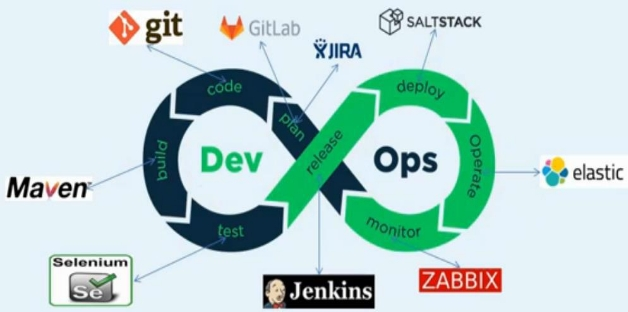
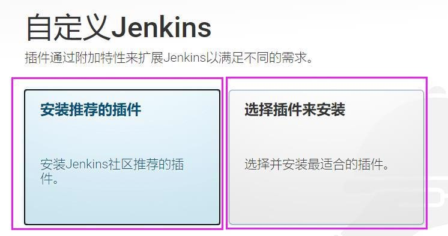
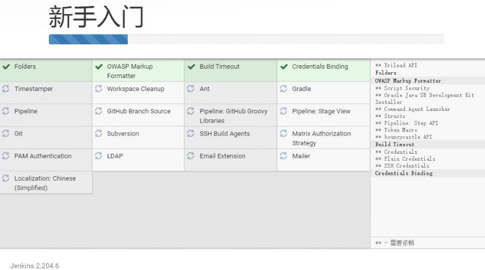
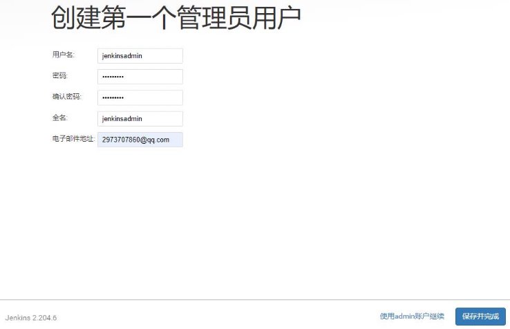
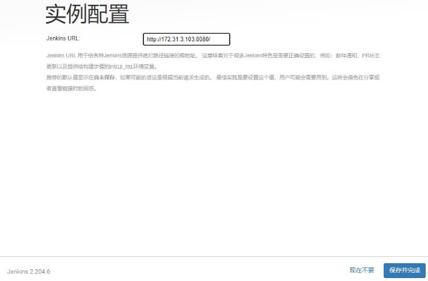
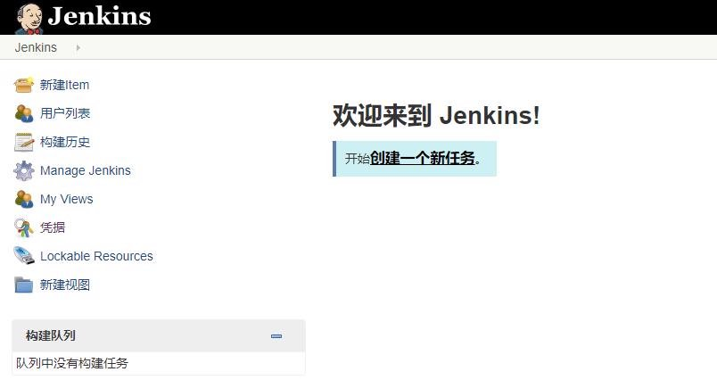



DevOps 实战训练营

讲师：杰哥 http://www.magedu.com

1.拥有 RHCA、 OpenStack、EXIN DevOps Master 等 专业证书。

2.多年大型互联网一线工作经验，曾在互联网金融和 互联网电商等公司任职架构师等职位。

3.曾带领运维团队，维护企业数千台服务器的业务规 模。

4.拥有十年一线工作经验。 5.熟练公有云与私有云应用与维护。

- 第一天**:**
  - Devops 与CI/CD简介
  - Gitlab 安装与Git 命令使用
  - Gitlab 实现持续集成
  - Gitlab 实现分支管理
- 第二天：
  - Jenkins 简介及安装
  - Jenkins 插件管理及基础配置
  - Jenkins 基于shell实现简单代码部署
  - Jenkins pipline简介及使用
- 第三天：
  - Sonarqube 简介及安装
  - 灰度部署、蓝绿环境、A/B测试等代码部署方式介绍
  - 企业级代码部署案例
  - 企业级代码回滚案例

第二天：

Jenkins 简介及安装

Jenkins 插件管理及基础配置 Jenkins 基于shell实现简单代码部署 Jenkins pipline简介及使用

Jenkins 简介:

Jenkins是一款开源 CI&CD 软件，用于自动化各种任务，包括构建、测试和部署软件。 使用java语言编写，起源于Hudson(Hudson原本是sun公司的开源项目，后sun被Oracle收购) 插件化，目前拥有1500+插件实现各种功能

Jenkins 安装: 

- apt install daemon && dpkg -i jenkins\_2.204.6\_all.deb 
- vim /etc/default/Jenkins

127.0.0.1 updates.jenkins-ci.org  

location /download/plugins {

proxy\_set\_header Host mirrors.tuna.tsinghua.edu.cn; proxy\_set\_header X-Real-IP $remote\_addr;

proxy\_set\_header X-Forwarded-For $proxy\_add\_x\_forwarded\_for; rewrite /download/plugins(.\*)  /jenkins/plugins/$1 break; proxy\_pass http://mirrors.tuna.tsinghua.edu.cn;

}

- systemctl  restart Jenkins

Jenkins 安装:

Jenkins 安装:

Jenkins 安装:

Jenkins 安装:

Jenkins 安装:

Jenkins 安装:

Jenkins 安装:

Jenkins 插件管理及基础配置 基础配置 

邮件通知配置 视图配置

插件管理

插件的安装

在线安装 离线安装

Jenkins pipline简介及使用： 

Pipline 代码部署案例： 

一：脚本化Pipline部署案例： 二：声明式Pipline部署案例：

我是谁:没有绝对安全的系统 模仿游戏

第三天：

Sonarqube 简介及安装 灰度部署、蓝绿环境、A/B测试等代码部署方式介绍 企业级代码部署案例

企业级代码回滚案例

Thank You!

讲师：张士杰（杰哥） http://www.magedu.com
