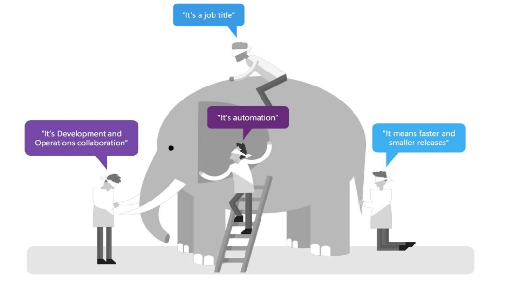
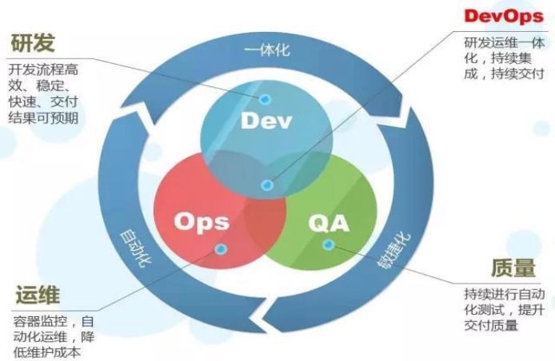
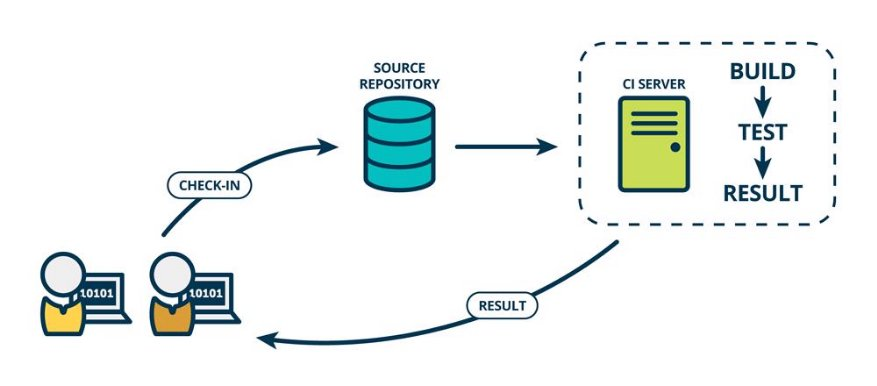
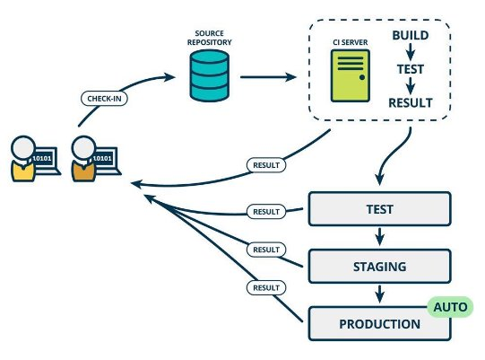
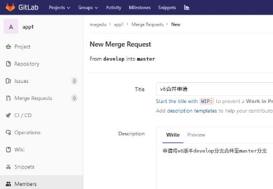



DevOps 实战训练营

讲师：杰哥 http://www.magedu.com

1.拥有 RHCA、 OpenStack、EXIN DevOps Master 等 专业证书。

2.多年大型互联网一线工作经验，曾在互联网金融和 互联网电商等公司任职架构师等职位。

3.曾带领运维团队，维护企业数千台服务器的业务规 模。

4.拥有十年一线工作经验。 5.熟练公有云与私有云应用与维护。

- 第一天**:**
  - Devops 与CI/CD简介
  - Gitlab 安装与Git 命令使用
  - Gitlab 实现持续集成
  - Gitlab 实现分支管理
- 第二天：
  - Jenkins 简介及安装
  - Jenkins 插件管理及基础配置
  - Jenkins 基于shell实现简单代码部署
  - Jenkins pipline简介及使用
- 第三天：
  - Sonarqube 简介及安装
  - 灰度部署、蓝绿环境、A/B测试等代码部署方式介绍
  - 企业级代码部署案例
  - 企业级代码回滚案例

第一天:

Devops 与CI/CD简介 Gitlab 安装与Git 命令使用 Gitlab 实现持续集成 Gitlab 实现分支管理

` `

DevOps 定义：

DevOps 是Development和Operations的组合，也就是开发和运维的简写。

DevOps集文化理念、实践与工具与一身，可以提高组织高速交付应用程序和服务的能力，与使用 传统软件开发和基础设施管理流程相比，能够帮助企业更快速的发展和改进产品，这种速度使企业 能够更好地服务于客户，并在市场上高效地参与竞争。

DevOps 是针对企业中的研发人员、运维人员和测试人员的工作理念，是他们在应用开发、代码部 署和质量测试等整条生命周期中协作和沟通的最佳实践，DevOps 强调整个组织的合作以及交付和 基础设施变更的自动化、从而实现持续集成、持续部署和持续交付。

DevOps 定义：

DevOps 平台：代码托管(gitlab/svn)、项目管理 平台)、持续交付(Jenkins/gitlab)

(jira/禅道/Teambition)、运维平台

(腾讯蓝鲸/自主研发

什么是**DevOps**： 
**

DevOps 定义：

为什么要推广DevOps：

DevOps 强调团队协作、相互协助、持续发展，然而传统的模式是开发人员只顾开发程序，运维 只负责基础环境管理和代码部署及监控等，其并不是为了一个共同的目标而共同实现最终的目的， 而DevOps 则实现团队作战，即无论是开发、运维还是测试，都为了最终的代码发布、持续部署和业 务稳定而付出各自的努力，从而实现产品设计、开发、测试和部署的良性循环，实现产品的最终持 续交付。

DevOps的优势：

速度：应用版本快速的迭代更新，以更好地适应不断变化的市场需求。 快速交付：更快的将应用交付至生产环境。 可靠性：保证应用交付的结果是成功的。 规模：可以在大规模环境下且可靠的交付应用。 增强合作：建立适应DevOps文化模式的团队，开发人员和运维人员协同工作。 安全性：在快速迭代的同时保证应用的质量。

CI/CD简介： 

什么是持续集成(CI-Continuous integration)： 

持续集成是指多名开发者在开发不同功能代码的过程当中，可以频繁的将代 码行合并到一起并切相互不影响工作。

持续集成CI：

CI/CD简介： 

什么是持续部署(CD-continuous deployment)： 

是基于某种工具或平台实现代码自动化的构建、测试和部署到线上环境以实 现交付高质量的产品,持续部署在某种程度上代表了一个开发团队的更新迭代 速率。

CI/CD：

计划 开发 构建 测试 监控 运营 发布 部署

**持续部署**CD**：**

5. Merge To   7. UT 9. Deploy To   11. System Test 13. Deploy To  Product Master Test Env Env 100%

Master Branch

6. Build 8. Build   10. Smoke Test 12. Deploy To  Docker Image Product Env 10%

\4. Code Review 

Develop Branch 

\1. Build 2. UT 3. Sonar 

   

Git **简介： **

Git： 由linux之父Linus Torvalds(林纳斯·托瓦兹,1969年12月28日出生)在2005年开发的一个分 布式持续集成工具，设计之初就具备了以下优点：

可靠性：数据的上传和下载必须是安全的、一致的，所有行为都要进行验证，数据的变更通过不同的版本 进行逻辑隔离。

分布式：Linus Torvalds认为之前的集中式版本控制系统性能太差，于是git的代码恢复不依赖于中央服务 器，而是每个开发电脑都是一个本地仓库，可用于代码提交与回滚。

高效：Git基于分布式的功能实现代码的快速提交与秒级回滚。

Github：基于git的一个公有代码仓库, GitHub于2008年4月10日正式上线，2018年6月，微软宣布通 过75亿美元的股票交易收购GitHub。

Gitlab：基于git的一个私有代码仓库。

Gitlab 安装： 

[https://docs.gitlab.com/ce/install/requirements.html ](https://docs.gitlab.com/ce/install/requirements.html)#安装环境要求 [https://mirrors.tuna.tsinghua.edu.cn/gitlab-ce/ #国内下载地](https://mirrors.tuna.tsinghua.edu.cn/gitlab-ce/)址 root@gitlab:~# dpkg -i gitlab-ce\_11.11.8-ce.0\_amd64.deb

root@gitlab:~# vim  /etc/gitlab/gitlab.rb

external\_url 'http://172.31.3.101' gitlab\_rails['smtp\_enable'] = true gitlab\_rails['smtp\_address'] = "smtp.qq.com" gitlab\_rails['smtp\_port'] = 465 gitlab\_rails['smtp\_user\_name'] = "2973707860@qq.com" gitlab\_rails['smtp\_password'] = "huyhivwhldbodhda" gitlab\_rails['smtp\_domain'] = "qq.com" gitlab\_rails['smtp\_authentication'] = :login gitlab\_rails['smtp\_enable\_starttls\_auto'] = true gitlab\_rails['smtp\_tls'] = true gitlab\_rails['gitlab\_email\_from'] = "2973707860@qq.com" user["git\_user\_email"] = "2973707860@qq.com"

root@gitlab:~# gitlab-ctl  reconfigure

Gitlab 安装：

#gitlab安装目录： /etc/gitlab #配置文件目录 /run/gitlab #运行pid目录 /opt/gitlab #安装目录 /var/opt/gitlab #数据目录 /var/log/gitlab #日志目录

- gitlab-ctl   #客户端命令行操作行
- gitlab-ctl  stop #停止gitlab
- gitlab-ctl  start #启动gitlab
- gitlab-ctl  restart #重启gitlab
- gitlab-ctl  status #查看组件运行状态
- gitlab-ctl  tail nginx #查看某个组件的日志

Git 命令使用： 

git config --global user.name “name“ #设置全局用户名 

git config --global user.email xxx@xx[.com#设置全局邮](mailto:xxx@xx.com)箱

git config --global  --list #列出用户全局设置

git clone htt[p://172.31.3.101/magedu/app1.git #c](http://172.31.3.101/magedu/app1.git)lone项目到本地 git add index.html ./ #添加指定文件、目录或当前目录下所有数据到暂存区 git commit -m  “v1” #提交文件到本地工作区(本地仓库)

git status #查看本地工作区和暂存区的状态

git push #提交代码到服务器

git pull #从gitlab更新代码到本地

git log #查看操作日志

vim .gitignore #定义忽略某些指定文件或者目录不上传至gitlab

git reset --hard HEAD^^ #git版本回滚， HEAD为当前版本，加一个^为上一个，^^为上上一个版本 git reflog # #获取每次提交的ID，可以使用--hard根据提交的ID进行版本回退

git reset --hard 5ae4b06 #回退到指定id的版本

git branch #查看当前所处的分支

git checkout  -b develop #创建并切换到一个新分支 git checkout   develop #切换分支

Git 命令使用：

工作区：clone的代码或者开发自己编写的代码文件所在的目录，通常是代码所在的一个服务的目录 名称。

暂存区：用于存储在工作区中对代码进行修改后的文件所保存的地方，使用 本地仓库：用于提交存储在工作区和暂存区中改过的文件地方，使用 远程仓库：多个开发共同协作提交代码的仓库，即gitlab服务器。

git add添加。 git commit 提交。

Gitlab 实现分支管理：

常见的分支结构：

单分支模型：只有master分支 生产/开发模型：master分支与develop类型分支 特性/发布模型：master/develop/feature类型分支 开发/发布/分离模型：master/develop/feature/release类型分支 开发/发布/缺陷分离模型：master/develop/feature/release/hotfix类型分支

Gitlab 实现分支合并：

命令合并： 

- git pull 
- git merge origin/develop 
- git push 

Web合并： 

` `

第二天：

Jenkins 简介及安装

Jenkins 插件管理及基础配置 Jenkins 基于shell实现简单代码部署 Jenkins pipline简介及使用

第三天：

Sonarqube 简介及安装

灰度部署、蓝绿环境、 企业级代码部署案例 企业级代码回滚案例

A/B测试等代码部署方式介绍

Thank You!

讲师：张士杰（杰哥） http://www.magedu.com
