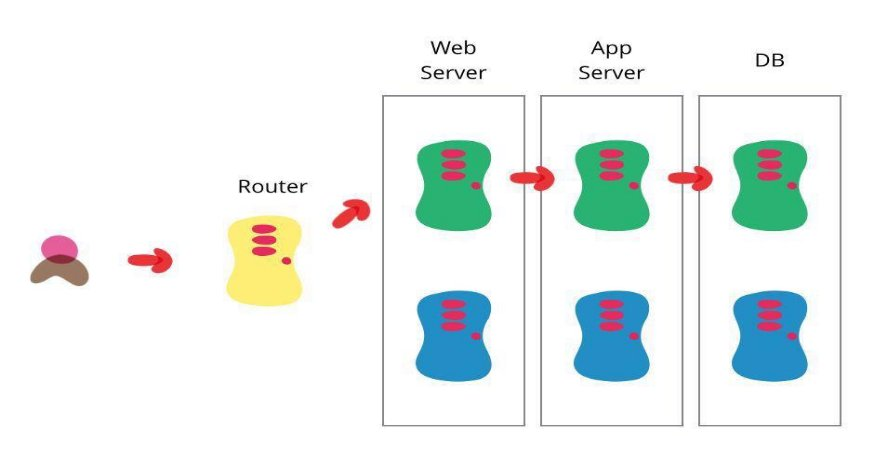

DevOps 实战训练营 

讲师：杰哥 http://www.magedu.com

1.拥有 RHCA、OpenStack、EXIN DevOps Master 等 专业证书。

2.多年大型互联网一线工作经验，曾在互联网金融和 互联网电商等公司任职架构师等职位。

3.曾带领运维团队，维护企业数千台服务器的业务规 模。

4.拥有十年一线工作经验。 5.熟练公有云与私有云应用与维护。

- 第一天**:**
  - Devops 与CI/CD简介
  - Gitlab 安装与Git 命令使用
  - Gitlab 实现持续集成
  - Gitlab 实现分支管理
- 第二天：
  - Jenkins 简介及安装
  - Jenkins 插件管理及基础配置
  - Jenkins 基于shell实现简单代码部署
  - Jenkins pipline简介及使用
- 第三天：
  - Sonarqube 简介及安装
  - 灰度部署、蓝绿环境、A/B测试等代码部署方式介绍
  - 企业级代码部署案例
  - 企业级代码回滚案例

第三天：

Sonarqube 简介及安装

灰度部署、蓝绿环境、A/B测试等代码部署方式介绍 企业级代码部署案例

企业级代码回滚案例

第三天：

Sonarqube 简介及安装 灰度部署、蓝绿环境、A/B测试等代码部署方式介绍 企业级代码部署案例

企业级代码回滚案例

Sonarqube 简介及安装： 

https://www.sonarqube.org/downloads/ 

#apt install -y openjdk-11-jdk #apt install postgresql -y

灰度部署、蓝绿环境、A/B测试等代码部署方式介绍

灰度部署：

也叫金丝雀发布，是指在两个版本之间能够平滑过渡的一种发布方式，灰度发布是增量发布的 一种类型，灰度发布是在原有版本可用的情况下，同时部署一个新版本应用作为“金丝雀”(小白鼠 )，测试新版本的性能和表现，以保障整体系统稳定的情况下，尽早发现、调整问题。

金丝雀发布、灰度发布步骤组成： 1、准备好部署各个阶段的工件，包括：构建工件，测试脚本，配置文件和部署清单文件。 2、从负载均衡列表中移除掉“金丝雀”服务器。 3、升级“金丝雀”应用（排掉原有流量并进行部署）。

4、对应用进行自动化测试。 5、将“金丝雀”服务器重新添加到负载均衡列表中（连通性和健康检查）。 6、如果“金丝雀”在线使用测试成功，升级剩余的其他服务器。（否则就回滚） 灰度发布可以保证整体系统的稳定，在初始灰度的时候就可以发现、调整问题，以保证其影响度。

灰度部署：

灰度部署、蓝绿环境、A/B测试等代码部署方式介绍

蓝绿部署：

蓝绿部署指的是不停老版本代码(不影响上一个版本访问)，而是在另外一套环境部署新版本然 后进行测试，测试通过后将用户流量切到新版本，其特点为业务无中断，升级风险相对较小。 具体过程：

1、当前版本业务正常访问(V1) 2、在另外一套环境部署新代码(V2)，代码可能是增加了功能或者是修复了某些bug 3、测试通过之后将用户请求流量切到新版本环境

4、观察一段时间，如有异常直接切换旧版本

5、下次升级，将旧版本升级到新版本(V3)

蓝绿环境：

灰度部署、蓝绿环境、A/B测试等代码部署方式介绍

A/B测试：

A/B测试也是同时运行两个APP环境，但是蓝绿部署完全是两码事，A/B 测试是用来测试应用功 能表现的方法，例如可用性、受欢迎程度、可见性等等，蓝绿部署的目的是安全稳定地发布新版本 应用，并在必要时回滚，即蓝绿部署是一套正式环境环境在线，而A/B测试是两套正式环境在线。

灰度部署、蓝绿环境、A/B测试等代码部署方式介绍

企业级代码部署案例

虚拟机部署案例：

虚拟机访问环境：

http://172.31.3.188/devops/  #生产 http://172.31.3.190/devops   #灰度

Kubernetes部署案例：

k8 sdashboard：

https://172.31.7.209:30002/ 

tomcat： http://172.31.7.209:40003/devops/ 

Nginx： http://172.31.7.209:40002/devops/ 

负载均衡：

http://172.31.3.189/devops 

**持续部署**CD**：**

\5. MeMrgaes tTeor   Test Env 11. System  Env 100%

\7. UT 9. Deploy To   Test 13. Deploy To  Product 

Master Branch

\6. Build 8. Build   10. Smoke Test 12. Deploy To  

Docker Image Product Env 10%

\4. Code Review 

Develop Branch 

\1. Build 2. UT 3. Sonar 

   

Thank You!

讲师：张士杰（杰哥） http://www.magedu.com
